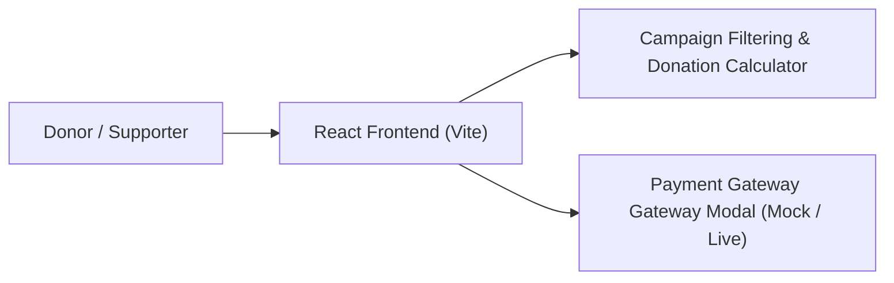
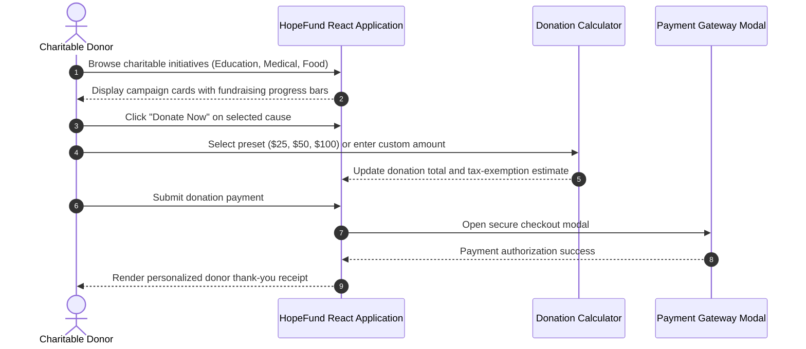

# HopeFund — Online Philanthropy & Donation Platform
[]()
[]()
[]()
[]()

## Overview
HopeFund is a modern philanthropic crowdfunding and donation web platform built with React, Vite, and Tailwind CSS. Designed to connect non-profit initiatives, charitable campaigns, and philanthropists, it provides seamless campaign discovery, transparent goal tracking, and donation processing.

- **Problem Solved:** Trust and transparency in philanthropic donations with visual funding meters.
- **Target Users:** Non-profits, donors, volunteers, and campaign creators.
- **Current Status:** Functional Web Application.

## Features
- **Campaign Discovery:** Browse active causes by category (Healthcare, Education, Disaster Relief, Animals).
- **Progress Tracking:** Real-time visual progress bars tracking funds raised against target goals.
- **Interactive Donation Flow:** Flexible giving options (one-time or recurring contributions).
- **Impact Metrics:** Dashboard showcasing live statistics on lives impacted and total funds distributed.

## Architecture


## User Flow


## Technology Stack
| Layer | Technology | Purpose |
|---|---|---|
| Framework | React 18, Vite | High-performance responsive frontend |
| Styling | Tailwind CSS | Modern philanthropy UI design system |
| Icons | Lucide React | Clean semantic iconography |

## Infrastructure
- **Development Port:** 5173
- **Hosting:** Vercel / Netlify / Cloudflare Pages

## Project Structure
```text
Donation/
├── src/
│   ├── components/      # CampaignCard, DonationModal, Navbar, Hero, Stats
│   ├── data/            # Mock campaigns and charitable initiatives
│   ├── App.tsx          # Root layout and view controller
│   └── main.tsx         # Application entry
├── index.html           # HTML template
├── package.json         # Dependencies
├── vite.config.ts       # Vite build setup
├── .gitignore           # Git ignore definitions
└── README.md            # Technical documentation
```

## Prerequisites
- Node.js >= 18.x
- npm >= 9.x

## Environment Variables
Copy `.env.example` to `.env` and configure placeholders:
```env
VITE_STRIPE_PUBLIC_KEY=your_stripe_publishable_key_optional
VITE_API_BASE_URL=https://api.hopefund.org_optional
```

## Local Development Setup
1. Clone the repository:
   ```bash
   git clone https://github.com/Bhanutejanallamothu/Donation.git
   cd Donation
   ```
2. Install dependencies:
   ```bash
   npm install
   ```
3. Run development server:
   ```bash
   npm run dev
   ```
4. Open `http://localhost:5173`.

## Docker Setup
*Not detected in repository.*

## Database Setup
*Not applicable. Prototype uses client-side state and mock campaign datasets.*

## API Documentation
*Client-side single-page application.*

## Deployment
Build static assets:
```bash
npm run build
```

## Security
- Input sanitization on donation custom amounts.
- Strict HTTPS transport for all payment modal interactions.

## Testing
Run build validation:
```bash
npm run build
```

## Troubleshooting
- **Styling Issues:** Verify Tailwind CSS directives are loaded in `src/index.css`.

## Future Improvements
- Razorpay / Stripe live checkout session integration.
- Automated tax-deductible donation receipt PDF generation.

## License
No formal open-source license provided. All rights reserved by repository owner.
